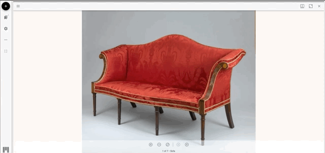

# Working with Images

## Zoom In / Zoom Out

In order to zoom in on an image using only the mouse, hover the mouse cursor over the point you would like to zoom to and left-click the image. A single click increase the zoom level of the image by one increment, and successive clicks will continue to increase the zoom level until the maximum resolution has been reached. In order to zoom back out, hold the shift button and left click.

Keyboard: The keyboard shortcuts for zoom in/out are _shift + up/down arrow._

## Pan

In addition to zoom, Mirador enables the user to pan across images, particularly useful when an image is zoomed to a level that fills the whole window. In order to pan an image, hover the cursor over the image and hold the left mouse button down. While continuing to hold the button down use the mouse to drag the image in the direction you would like to move.

Keyboard shortcuts for pan are the arrow keys.

## Navigating Multiple Images

Many Museum objects have multiple images that are grouped together in Mirador. While the first image displayed will always be the primary view of the object, additional images can be accessed and cycled through using the previous/next buttons located at the bottom of the window.

## Accessing Object Data

Along with high-resolution images, the Museum provides basic cataloguing data for it's objects in Mirador. This can be toggled on/off using the control at the upper right corner of the window.

