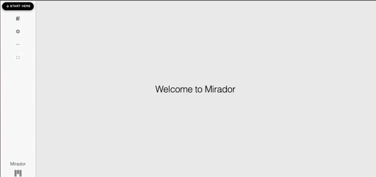

# Adding and Removing Objects

Upon first opening Mirador in a list view configuration, the user will be presented with an empty image viewing window. Upon clicking the "Start Here" button in the top left corner of the window, the screen will change to a list of available objects for this Mirador viewer. Selecting an object from the list will then add it to the viewer window, and the view will change to the familiar high-resolution image display.

In order to remove an object from the window and select another for viewing, click the close window icon in the upper right corner of the window denoted by an X. This will remove the object from the window and bring back the "Start Here" button, by which point another object can be selected from the list window.

